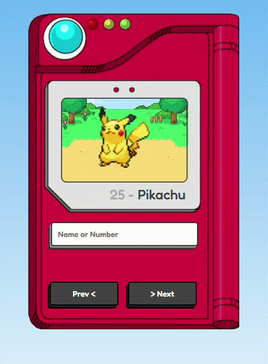

# Pokédex

Bem-vindo ao projeto **Pokédex**! Este projeto tem como objetivo criar uma aplicação interativa onde você pode explorar e pesquisar os diferentes Pokémon. A Pokédex é uma ferramenta clássica dos jogos Pokémon que armazena informações sobre os Pokémon que você encontra.



## Funcionalidades

- Pesquisa de Pokémon por nome ou ID.
- Design responsivo, funcionando em dispositivos móveis e desktop.
- Integração com a API pública de Pokémon para buscar as informações.

## Tecnologias utilizadas

- **HTML5**: Estrutura básica da página.
- **CSS3**: Estilização da interface do usuário.
- **JavaScript**: Lógica para interatividade e chamadas à API.
- **API PokéAPI**: Fonte de dados para informações de Pokémon.

## Como rodar o projeto

1. Clone o repositório para o seu computador:
   ```bash
   git clone https://github.com/isaacggr/pokedex.git
